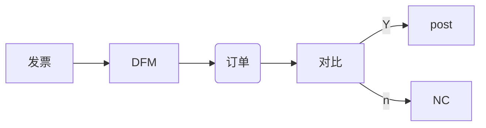

* 传统方式:



* new
  * 在本地
    ```mermaid
    graph LR
    发票 --> DFM --> PDF上传OCR --> submited(人工智能提取信息,但是需要人工)
    submited --N-->NC(NC但是nclist,同时给到DFM)
    submited --Y-->submit(提取出数据文件)
    submit --> data最多数据
    submit --> inv中数据
    submit --> po最少数据
    ```
  * 本地到云
    ```mermaid
    graph LR
    po文件在本地--> HIP --> loreal环境 --> SAP -->GET通过po文件获取信息得gr文件在云端
    ```

    ```mermaid
    graph LR
    inv,po,gr进行三单匹配 --Y--> 成功 -->得到ready文件 --> loreal --> SAP1(SAP)--Y-->posted/postf,给到DFM
    SAP1 --N-->NC,给到DFM
    inv,po,gr进行三单匹配 --N--> 失败 -->NC,给到DFM
    ```
  
在给到DFM的时候会将数据同步给到本地
OCR是分析PDF文件的

\\\SGAPWPPD01\Finance\InvoiceWave3PRD   文件夹下面的loreal 文件夹存放是

  
